  

# Hi, I'm Mehmet Emin 👋

Cybersecurity learner focused on practical security automation, networking, and Python-based tooling.

I turn security concepts into small, testable projects, with an emphasis on responsible and authorized use.

  <a href="#featured-projects"><b>Projects</b></a> ·
  <a href="#tools-and-technologies"><b>Toolbox</b></a> ·
  <a href="#quick-quiz"><b>Quiz</b></a> ·
  <a href="#activity"><b>Activity</b></a> ·
  <a href="#principles"><b>Principles</b></a> ·
  <a href="#get-involved"><b>Get involved</b></a>

## What I'm working on

- Python automation for security and system tasks — the SİBERTİM Toolkit puts 40 system, network and security tasks behind one desktop window.
- Web security testing fundamentals and HTTP analysis — Extension Scanner reads raw status codes (`200` / `401` / `403`) with redirects turned off; the toolkit checks six HTTP security headers and SSL certificate details.
- Networking, defensive security, and Windows tooling — ARP discovery with Scapy, port / DNS / traceroute / whois lookups, and shortcuts to SFC, CHKDSK and the Windows firewall.
- Clearer documentation, reproducible steps, and maintainable code — Turkish / English READMEs with install steps, release builds for people without Python, and a usage disclaimer on every security tool.

## Featured projects

- **[Extension Scanner](https://github.com/memx13/Extension_Scanner)** — A multi-threaded Python tool for checking authorized targets for exposed sensitive files and directories.

  

  
<b>Under the hood</b> · Python · MIT · v1.0.0 <code>.exe</code>

  - Checks 26 well-known paths: `.env` variants, `.git/config`, `.git/index`, `config.php` / `wp-config.php` backups, SQL dumps, `backup.zip`, `.ssh/id_rsa`, `server-status`, `docker-compose.yml`, `.bash_history` and more.
  - 10 worker threads pull paths from a shared `Queue`; a lock keeps the coloured console output readable.
  - Requests are sent with `allow_redirects=False`, so a redirect to the home page is not mistaken for a hit. Each request has a 7-second timeout.
  - Explains each result while it runs: `200` readable, `403` there but blocked, `401` asks for credentials. `404` responses are hidden to keep the output short.
  - Download: [Windows build in Releases](https://github.com/memx13/Extension_Scanner/releases).

  

- **[SİBERTİM Toolkit](https://github.com/memx13/toolkitt)** — A Windows desktop toolkit that brings together system, networking, encoding, and security utilities in a CustomTkinter interface.

  

  
<b>Under the hood</b> · Python · CustomTkinter · 40 tools

  | Group | Tools |
  | --- | --- |
  | Windows quick access (8) | Control Panel, Registry Editor, Device Manager, Disk Management, Services, Performance Monitor, Firewall with Advanced Security, Task Manager |
  | System & network info (7) | `systeminfo`, `ipconfig /all`, public IP, ping, DNS cache flush, whois, traceroute |
  | Security checks (14) | IP geolocation, domain ↔ IP resolver, MAC vendor lookup, common-port lookup, security-header check, Scapy ARP sweep, TCP port scan (1–1024), quick Nmap (`-F`), DNS records, HTTP header dump, SSL certificate info, subdomain check, link spider, directory discovery |
  | Maintenance & repair (5) | SFC, CHKDSK, `gpupdate /force`, firewall on / off |
  | Utilities (6) | text hash, file hash, password generator, URL / Base64 / ROT13 encode-decode |

  - Long tasks run on background threads and send results back to the window with `after()`, so the interface does not freeze during a scan.
  - Asks for administrator rights at start-up (`IsUserAnAdmin` → `runas`), because ARP scans, SFC and firewall commands need them.
  - The header check looks for `Content-Security-Policy`, `Strict-Transport-Security`, `X-Content-Type-Options`, `X-Frame-Options`, `Referrer-Policy` and `Permissions-Policy`.
  - Source code: [toolkitt](https://github.com/memx13/toolkitt) · packaged build: [toolkit v1.0.0](https://github.com/memx13/toolkit/releases).

  

<b>More from the workbench</b> — a browser extension, a C# desktop app and a Python console app

 

| Project | Stack | What it does |
| --- | --- | --- |
| [Anket Smasher](https://github.com/memx13/Anket-Smasher) | JavaScript · Chrome Manifest V3 | Fills long mandatory survey forms in one click. Asks only for `activeTab` and `scripting`, recognises ARIA `role="radio"` / `role="checkbox"` elements as well as plain inputs, and fires `mousedown` / `mouseup` / `click` / `input` / `change` events so framework-based forms register the answers. No external libraries. |
| [otobusbileti](https://github.com/memx13/otobusbileti) | C# · WinForms | Bus ticket sales form: route (from / to), bus company, date and price fields, a seat map generated as buttons at runtime with click-to-toggle selection, a running total, and a separate customer entry form. |
| [Kitap Takip](https://gist.github.com/memx13/048f266b9d37fd88c385c071be44db8d) | Python · gist | Console reading-list app: add, list, mark as read and delete books. Rejects empty titles and authors, and keeps the list in a UTF-8 JSON file between runs. |

## Tools and technologies

**Python · C# · JavaScript · Git · HTTP · Networking · CustomTkinter**

  <picture>
    <source media="(prefers-color-scheme: dark)" srcset="https://raw.githubusercontent.com/memx13/memx13/output/langs-dark.svg">
    <source media="(prefers-color-scheme: light)" srcset="https://raw.githubusercontent.com/memx13/memx13/output/langs-light.svg">
    
  </picture>

| Tool | Where it shows up |
| --- | --- |
| Python | Extension Scanner, SİBERTİM Toolkit and Kitap Takip, with `requests`, `threading` / `queue`, Scapy, dnspython, python-whois, BeautifulSoup and colorama |
| C# | otobusbileti, a WinForms ticket sales form |
| JavaScript | Anket Smasher, a Manifest V3 extension written without libraries |
| Git | Version history, plus GitHub Releases for the `.exe` and `.zip` builds |
| HTTP | Status-code triage, redirect handling, header and SSL certificate checks |
| Networking | ARP sweeps, TCP port scans, DNS records, traceroute, whois |
| CustomTkinter | The toolkit's splash screen, tool panel and output pane |

## Quick quiz

Four questions taken from the tools above. Click a question to open its answer.

<b>1.</b> A scan returns <code>403 Forbidden</code> for <code>/.git/config</code>. Is the file there?

 

Probably, but it is a lead and not proof. Extension Scanner reports `403` as "there, but access is blocked", because the server (or a WAF in front of it) refused the request instead of answering `404`. Some servers return `403` for every dotfile whether it exists or not, so the next step is to compare with a path that cannot exist.

<b>2.</b> Why does Extension Scanner send its requests with redirects turned off?

 

Many sites answer unknown paths with a redirect to the home page. Following it ends in a `200`, and every path in the wordlist would look exposed. With `allow_redirects=False` the scanner judges the first response it gets.

<b>3.</b> Decode this: <code>Hfr frphevgl gbbyf bayl ba flfgrzf lbh bja</code>

 

It is ROT13: every letter moves 13 places, so applying it twice gives the original text back. The line decodes to "Use security tools only on systems you own", the start of the first principle below. The toolkit has a ROT13 tool under Utilities. ROT13 is an encoding and not encryption, because there is no key.

<b>4.</b> Which response header tells a browser to use only HTTPS for a site from now on?

 

`Strict-Transport-Security` (HSTS). It is one of the six headers the toolkit's security-header check looks for, next to `Content-Security-Policy`, `X-Content-Type-Options`, `X-Frame-Options`, `Referrer-Policy` and `Permissions-Policy`.

## Activity

  <picture>
    <source media="(prefers-color-scheme: dark)" srcset="https://raw.githubusercontent.com/memx13/memx13/output/snake-dark.svg">
    <source media="(prefers-color-scheme: light)" srcset="https://raw.githubusercontent.com/memx13/memx13/output/snake-light.svg">
    
  </picture>

A GitHub Actions [workflow](.github/workflows/profile.yml) redraws this snake from my contribution graph once a day and refreshes the table of latest pushes below.

<!-- recent:start -->
| Repository | Language | Last push | Latest release |
| --- | --- | --- | --- |
| [Anket-Smasher](https://github.com/memx13/Anket-Smasher) | JavaScript | 2026-02-02 | — |
| [Extension_Scanner](https://github.com/memx13/Extension_Scanner) | Python | 2025-12-18 | [v1.0.0](https://github.com/memx13/Extension_Scanner/releases/tag/v1.0.0) |
| [toolkit](https://github.com/memx13/toolkit) | — | 2025-11-25 | [v1.0.0](https://github.com/memx13/toolkit/releases/tag/v1.0.0) |
| [toolkitt](https://github.com/memx13/toolkitt) | Python | 2025-10-22 | — |
| [otobusbileti](https://github.com/memx13/otobusbileti) | C# | 2025-01-06 | — |
<!-- recent:end -->

## Principles

- Use security tools only on systems you own or have explicit permission to test.
- Prefer practical learning, clear documentation, and reproducible results.
- Explain the result instead of only printing it. Extension Scanner shows what `200`, `401` and `403` mean before the scan starts.

## Get involved

- Know a sensitive path the scanner should check? [Suggest it for the wordlist](https://github.com/memx13/Extension_Scanner/issues/new?title=Wordlist+suggestion%3A+%2Fpath&body=Path%3A%0A%0AWhy+it+is+worth+checking%3A%0A).
- Missing a tool in the toolkit, or found a bug? [Open an issue](https://github.com/memx13/toolkitt/issues/new?title=Tool+idea%3A+&body=What+should+it+do%3F%0A%0AWhich+group+does+it+belong+to+%28quick+access%2C+system+%26+network%2C+security+checks%2C+maintenance%2C+utilities%29%3F%0A). The toolkit README asks for feedback there.
- Curious how this page updates itself? Read [`profile.yml`](.github/workflows/profile.yml).

<b>Türkçe özet</b>

 

Siber güvenlik öğreniyorum; pratik güvenlik otomasyonu, ağ ve Python tabanlı araçlar üzerine çalışıyorum. Güvenlik kavramlarını küçük, test edilebilir projelere dönüştürüyorum. Güvenlik araçlarını yalnızca sahibi olduğunuz ya da test için açık izin aldığınız sistemlerde kullanın.

- **[Extension Scanner](https://github.com/memx13/Extension_Scanner)** — İzinli hedeflerde açıkta kalmış hassas dosya ve dizinleri arayan çok iş parçacıklı Python aracı (26 yol, 10 iş parçacığı).
- **[SİBERTİM Toolkit](https://github.com/memx13/toolkitt)** — Sistem, ağ, kodlama ve güvenlik araçlarını CustomTkinter arayüzünde toplayan Windows masaüstü araç seti (5 grupta 40 araç).
- Diğerleri: [Anket Smasher](https://github.com/memx13/Anket-Smasher) (Chrome eklentisi), [otobusbileti](https://github.com/memx13/otobusbileti) (C# WinForms), [Kitap Takip](https://gist.github.com/memx13/048f266b9d37fd88c385c071be44db8d) (Python konsol uygulaması).

